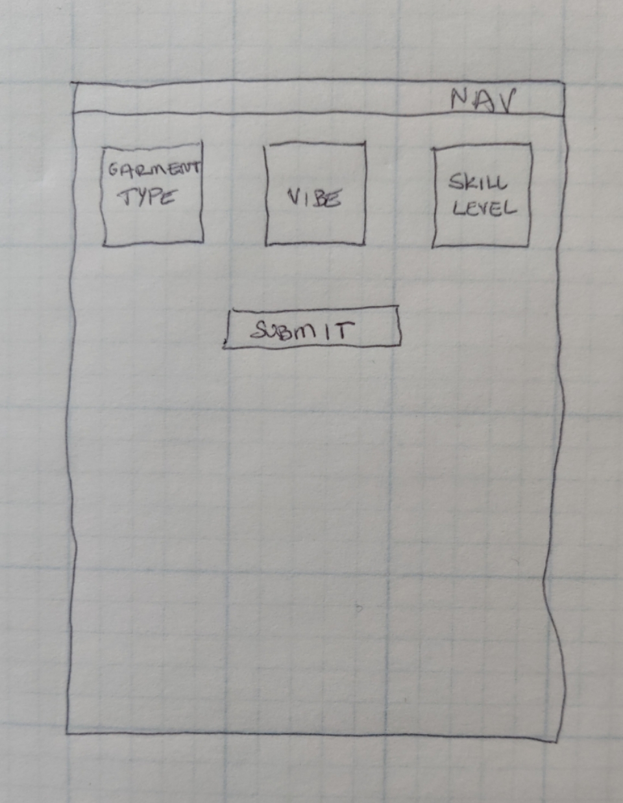
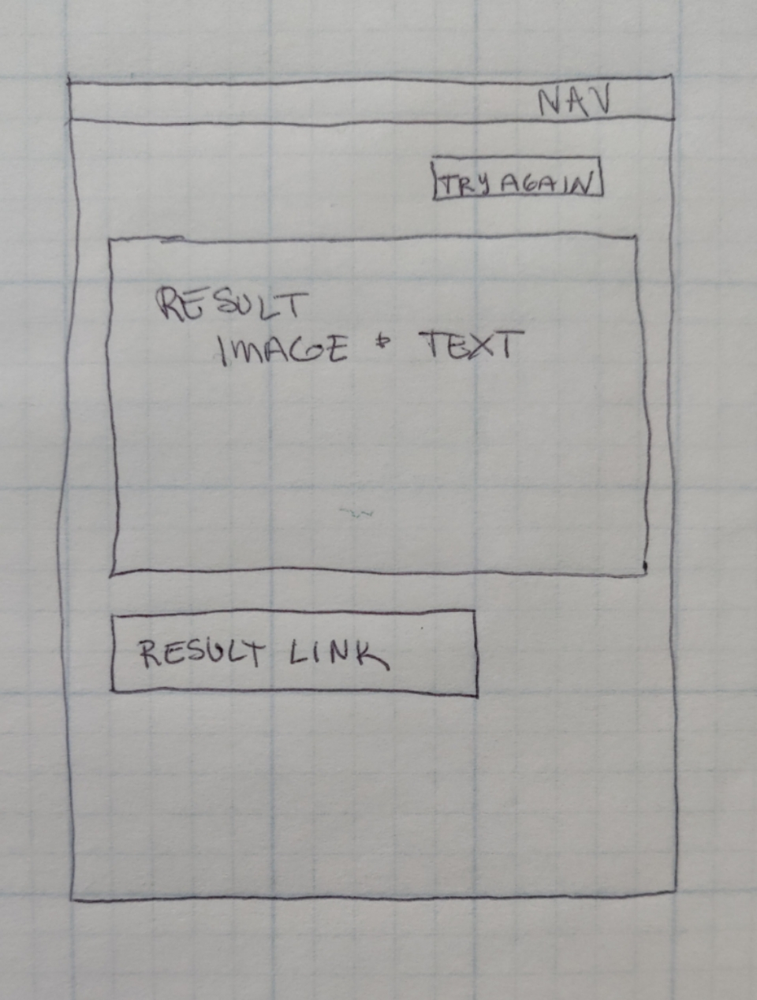

# Design Specification

## Problem

Overconsumption of clothing in the United States uses a massive amount of resources and generates millions of tons of waste annually. The most effective way to reduce the environmental impact of clothing is to buy less of it.

The fashion industry is responsible for 10% of all greenhouse gas emissions and 20% of global waste water. The World Resources Institute reports that it takes 2,700 liters of water to make one cotton shirt.

Recent reductions in cost and quality of clothing ("fast fashion") has increased consumption. Americans purchase an average of 50 items per year. While most items of clothing can last for many years, changing fashions and plentiful cheap choices artificially shorten useful lifespans. Modern clothing has a lifespan of between 2-10 years.

Americans throw away about 81 pounds of clothing per person per year. That's figure has doubled in the last 20 years. In 2018, 34 billion pounds of textile waste went to landfills in the US, according to the Environmental Protection Agency.

Textiles can take up to 200 years to decompose in landfills, but they are also difficult and expensive to recycle. Only about 14% of clothes and shoes thrown away in the US end up being recycled. The other 86% are dumped in landfills or burned. The challenges with recycling are that garments are made up of blended fibers and multiple materials (buttons, zippers, tags). Only some types of fibers can be recycled, and only after other materials are removed. Sorting must be done by hand and it's a time consuming process.

> A path for sustainable consumption and production requires circular economy approaches, designed to reduce or eliminate waste and pollution, keep products and materials in use, and regenerate natural systems. (UN Strategic Development Goal 12)

Existing solutions for individuals allow for reduction of consumpion. Buying clothing used from thrift stores, consignment shops, or directly from people via platforms like Depop allows people to have the fun of buying new clothes with very low environmental impact. Renting clothing from services like Rent the Runway allows garments to have longer lifespans and reduces manufacturing impact. These solutions are helping, but consumption is still growing, so they are not enough.

Some clothing manufacturers are also working on solutions. H&M stores collect clothing to recycle and give coupons to customers who participate. Patagonia's Worn Wear program offers store credit in exchange for used Patagonia brand goods, which are then refurbished and resold. Many other manufacturers use materials in construction that are recycled or have a lower environmental impact (e.g. bamboo, hemp). These are all impactful partial solutions.

### Citations

"The rapidly growing rate of natural resource consumption is unsustainable" https://unstats.un.org/sdgs/report/2021/Goal-12/

"Why clothes are so hard to recycle" https://www.bbc.com/future/article/20200710-why-clothes-are-so-hard-to-recycle

"The Environmental Crisis Caused by Textile Waste" https://www.roadrunnerwm.com/blog/textile-waste-environmental-crisis

"The 9 Essential Fast Fashion Statistics" https://earth.org/data_visualization/the-9-biggest-fast-fashion-statistics/

https://www2.hm.com/en_us/sustainability-at-hm/our-work/close-the-loop.html

https://wornwear.patagonia.com/

## Solution

This web application teaches users how to repair their existing clothing and inspires them to remix it, extending wear life and reducing motivation to buy more.

### Site Layout

The site has three pages: Home, Learn (*stretch goal*), and Idea Generator. The pages all link to each other via a navigation bar.

Home page is the main page. None of its content will be interactive. It contains information about the value of textile reuse, a call to action to try the Idea Generator, and a YouTube video on a mending technique. The video is fetched on page load from YouTube, so users should rarely see the same video twice.

Learn page contains content about sewing and mending techniques. *This page is a stretch goal*

On the learn page, there are three tabs at the top of the content, labeled "Repair", "Remix", and "Create." On arrival on the page "Repair" is selected.

The body of the page contains content relevant to the selected tab: one highlighted technique, with an image and some text about it, as well as a list of links to resources for other techniques. When the user clicks between tabs, the content changes. The "Repair" tab includes items like "darning knit goods" and "replacing a zipper", and when the user clicks on the "Create" tab the content includes items like "how to use a pattern."

Idea Generator page is an interactive page that suggests project ideas based on user input.

There are three select type form fields at the top of the page and a submit button. The three fields are "garment type", "vibe", and "skill level." Each field is optional, but at least one must have input for the form to submit successfully. If the user clicks the submit button without selecting any options, an error message will appear at the top of the form.

Garment type options will be:
 - t-shirt
 - button down shirt
 - skirt
 - jeans

Vibe options will be:
 - cottage core
 - festival
 - dad

Skill level options will be:
 - low
 - medium
 - high

When the form is submitted successfully, the application will select a remix idea from its data store that meets all of the requirements. There is no combination of options that will not have at least one matching remix idea.

When the form is submitted, a cute animation is briefly displayed to the user (*stretch goal*). Then, the form disappars and the page shows a "try again" button and a result. The result will be presented as an image, some introductory text, and a link to an external tutorial.

If the user clicks the "try again" button, the result disappears and the form reappears with all previous selections cleared.

